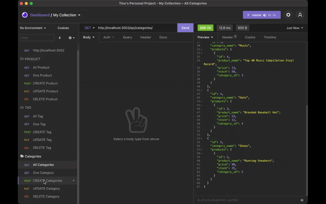

# E-CommerceBackEnd

# Table of Contents
  <ol>
    <li><a href="#description">Description</a></li>
    <li><a href="#usage">Usage</a></li>
    <li><a href="#appearance">Apperance</a></li>
    <li><a href="#links">Links</a></li>
    <li><a href="#contributors">Contributor</a></li>
    <li><a href="#license">License</a></li>
  </ol>

# Description 

E-commerce is the largest sector of the electronics industry, generating an estimated $29 trillion in 2019. E-commerce platforms like Shopify and WooCommerce provide a suite of services to businesses of all sizes. Due to their prevalence, the purpose of this homework is to build the back end for an e-commerce site by modifying starter code. We utilize a working Express.js API to use Sequelize to interact with a MySQL database.

# Usage

- [Javascript](https://www.javascript.com/)
- [Insomnia](https://insomnia.rest/)
- [Node.js](https://nodejs.org/en/)
- [MySQL2](https://www.npmjs.com/package/mysql2)
- [Sequelize](https://www.npmjs.com/package/sequelize)
- [dotenv](https://www.npmjs.com/package/dotenv)

# Appearance
- In Insomnia Core, the user tests “GET tags,” “GET Categories,” and “GET All Products.”.

- In Insomnia Core, the user tests “GET tag by id,” “GET Category by ID,” and “GET One Product.”

- In Insomnia Core, the user tests “DELETE Category by ID,” “CREATE Category,” and “UPDATE Category.”

# Link

GitHub Link: https://github.com/tpham912/E-CommerceBackEnd

# Contributor 

[Tina Pham](https://github.com/tpham912)

# License

Distributed under the MIT License 

